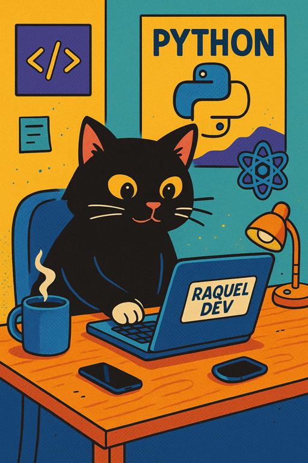

# 👋 Hi there! I'm Raquel

I'm a fullstack web developer passionate about creating useful and accessible solutions. I specialize in Laravel, REST APIs, Docker, and a bit of AI magic 🤖.

---

## 🧠 Tech Stack

---

## 💼 Experience

- 🔍 QA Manager for 3 years, now a backend developer with a strong focus on code quality
- 👥 Collaborate with international teams in agile environments (Scrum, Gitflow)
- 💬 Clear communication and a practical mindset

---

## 🚀 Featured Projects

| Project | Description | Technologies |
|--------|-------------|--------------|
| 🎬 [Movie App](https://github.com/raquel-patino/movies-page) | API with login, roles, and AI-based recommendations | Laravel, Passport, Swagger |
| 🏨 [Hotel Management](https://github.com/raquel-patino/5.API) | Complete system for reservations and billing | Laravel, MySQL, Docker |

---

## 📫 Contact

- 📧 r.patino.navarro@gmail.com  
- 💼 [LinkedIn](www.linkedin.com/in/raquel-patiño1)  
- 🌐 [Personal]()

